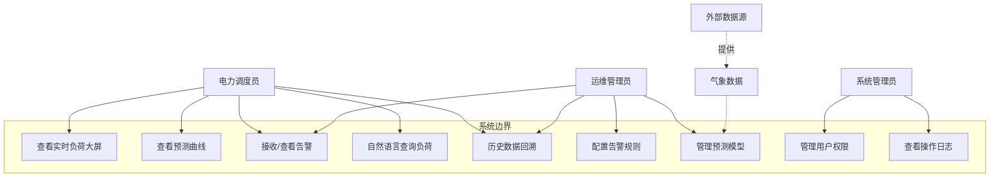
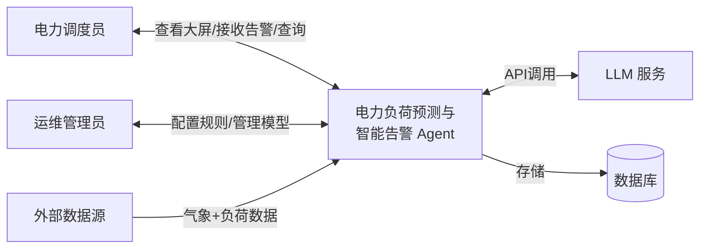
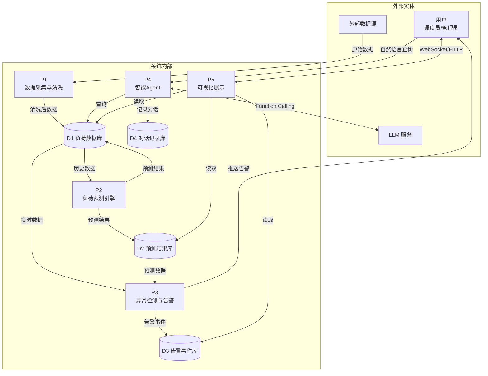

# ⚡ 电力负荷预测与智能告警 Agent — 需求规格说明书

> **版本**：v1.1 ｜ **日期**：2026-07-10 ｜ **作者**：暑期实训团队（4 人） ｜ **状态**：评审中

---

## 目录

1. [项目概述](#1-项目概述)
2. [用户角色](#2-用户角色)
3. [用户故事](#3-用户故事)
4. [功能清单](#4-功能清单)
5. [非功能性需求](#5-非功能性需求)
6. [用例图](#6-用例图)
7. [数据流图](#7-数据流图)
8. [术语表](#8-术语表)

---

## 1. 项目概述

### 1.1 项目背景

电力系统负荷预测是电网安全经济运行的基础。传统预测依赖人工经验，存在响应滞后、告警不及时、决策缺乏数据支撑等问题。本项目构建一个**集负荷预测、异常检测、智能告警于一体的 AI Agent 系统**，为电力调度人员提供数据驱动的辅助决策工具。

### 1.2 项目目标

| 目标 | 衡量指标 | 优先级 |
|:-----|:---------|:------:|
| 🎯 短期负荷预测 | 未来 24h 预测 MAPE < 5% | P0 |
| 🔔 异常检测与告警 | 异常识别准确率 > 90%，告警延迟 < 5s | P0 |
| 🤖 智能交互 | 支持自然语言查询负荷数据与趋势 | P1 |
| 📊 可视化大屏 | 实时刷新，支持历史数据回溯 | P0 |

### 1.3 项目范围

**包含**（16 天实训范围）：
- 历史负荷数据管理与查询
- 短期负荷预测（LSTM + Prophet 基线）
- 异常检测与多级告警
- LLM Agent 自然语言问答
- 实时可视化大屏

**不包含**（后续迭代方向）：
- 实时 SCADA 系统对接
- 多区域联合调度
- 真实电网拓扑建模

---

## 2. 用户角色

| 角色 | 描述 | 核心诉求 |
|:-----|:-----|:---------|
| ⚡ **电力调度员** | 日常监控负荷、处理告警的调度值班人员 | 快速了解当前负荷状态、接收及时告警、查看预测趋势 |
| 🔧 **运维管理员** | 管理系统配置、模型版本、告警规则的技术人员 | 配置告警阈值、管理数据源、查看模型性能 |
| 🛡️ **系统管理员** | 管理用户权限、系统运行状态 | 用户管理、日志审计、系统健康检查 |

---

## 3. 用户故事

### 3.1 电力调度员

| ID | 用户故事 | 优先级 | 验收标准 |
|----|----------|--------|----------|
| US-01 | 作为调度员，我希望能在大屏上看到实时负荷曲线，以便快速掌握当前电网运行状态 | P0 | 大屏每秒刷新，显示当前负荷值、变化趋势 |
| US-02 | 作为调度员，我希望能看到未来 24 小时的负荷预测曲线，以便提前安排调度计划 | P0 | 预测曲线与历史曲线同图展示，标注置信区间 |
| US-03 | 作为调度员，当负荷超过安全阈值时，我希望能收到醒目告警，包含告警级别和原因分析 | P0 | 告警卡片弹出，分红色/橙色/黄色三级，含模板生成的根因分析 |
| US-04 | 作为调度员，我希望能用自然语言查询负荷数据（如"昨天最高负荷是多少？"），降低操作门槛 | P1 | 对话式查询，3 秒内返回结果，支持图表展示 |
| US-05 | 作为调度员，我希望能回看任意历史时段的负荷数据，便于事后复盘 | P1 | 支持日历选择器 + 时间拖拽，历史数据 5 秒内加载 |
| US-06 | 作为调度员，我希望能收到未来可能出现的负荷异常的**预警**，而不是等发生后才知道 | P1 | 预测值超阈值时提前推送预警，附带建议应对措施 |

### 3.2 运维管理员

| ID | 用户故事 | 优先级 | 验收标准 |
|----|----------|--------|----------|
| US-07 | 作为运维管理员，我希望能配置告警规则（阈值、时间段、通知方式），适应不同季节/场景 | P1 | 表单配置，即时生效，支持模板 |
| US-08 | 作为运维管理员，我希望能查看模型预测精度的变化趋势，及时发现模型衰减 | P2 | 预测 vs 实际对比图 + MAPE/RMSE 趋势图 |
| US-09 | 作为运维管理员，我希望能手动触发模型重训练或切换模型版本 | P2 | 后台任务执行，进度条显示，完成后通知 |

### 3.3 系统管理员

| ID | 用户故事 | 优先级 | 验收标准 |
|----|----------|--------|----------|
| US-10 | 作为系统管理员，我希望能管理用户账号和权限 | P2 | 角色管理 + 权限分配 |
| US-11 | 作为系统管理员，我希望能查看系统运行日志和操作审计记录 | P2 | 日志搜索 + 导出 |

---

## 4. 功能清单

### 4.1 功能模块总览

```
电力负荷预测与智能告警 Agent
├── M1. 数据管理模块
│   ├── F1.1 负荷数据导入（CSV/API）
│   ├── F1.2 气象数据关联
│   ├── F1.3 数据质量检查与清洗
│   └── F1.4 历史数据查询 API
│
├── M2. 负荷预测模块
│   ├── F2.1 特征工程（时间特征、天气特征、节假日特征）
│   ├── F2.2 LSTM/Transformer 模型训练
│   ├── F2.3 Prophet 基线模型（可解释性对比）
│   ├── F2.4 模型评估与版本管理
│   └── F2.5 在线推理接口
│
├── M3. 异常检测与告警模块
│   ├── F3.1 基于阈值的实时告警
│   ├── F3.2 基于预测的趋势预警
│   ├── F3.3 基于统计的异常点检测（3-sigma / IQR）
│   ├── F3.4 告警分级（红/橙/黄）
│   └── F3.5 告警推送（WebSocket 实时推送）
│
├── M4. 智能 Agent 模块
│   ├── F4.1 LLM 告警文案生成（含根因分析 + 建议）
│   ├── F4.2 自然语言查询（Text-to-SQL / Function Calling）
│   ├── F4.3 多轮对话上下文管理
│   └── F4.4 Agent 决策建议（提示减载/调峰策略）
│
├── M5. 可视化大屏模块
│   ├── F5.1 实时负荷仪表盘
│   ├── F5.2 历史/预测曲线对比图
│   ├── F5.3 告警事件列表与时间线
│   ├── F5.4 统计卡片（峰值、谷值、平均值、负荷率）
│   └── F5.5 天气信息展示
│
└── M6. 系统管理模块
    ├── F6.1 用户登录/权限管理
    ├── F6.2 告警规则配置
    ├── F6.3 模型管理（版本切换/重训练）
    └── F6.4 操作日志审计
```

### 4.2 功能优先级矩阵

| 优先级 | 功能编号 | 说明 |
|:-------|:---------|:-----|
| 🔴 **P0** — MVP 必须交付 | F1.1, F1.4, F2.2, F2.5, F3.1, F3.4, F5.1, F5.2, F5.3, F5.4 | 核心链路：数据 → 预测 → 告警 → 展示 |
| 🟠 **P1** — 重要尽量交付 | F1.2, F2.1, F2.3, F2.4, F3.2, F3.3, F3.5, F4.1, F4.2, F5.5, F6.2 | 差异化亮点：智能告警 + NL 交互 |
| 🟢 **P2** — 加分有余力 | F1.3, F4.3, F4.4, F6.1, F6.3, F6.4 | 体验提升：对话 + 管理 |

---

## 5. 非功能性需求

### 5.1 性能要求

| 指标 | 目标值 | 说明 |
|:-----|:-------|:-----|
| 预测 API 响应时间 | < 1s | 单次 24h 预测 |
| 大屏数据刷新频率 | ≥ 1 次 / 秒 | WebSocket 实时推送 |
| 历史数据查询 | < 3s | 1 年数据量级 |
| LLM Agent 响应 | < 5s（告警）/ < 10s（NL 查询） | SSE 流式输出 |
| 并发用户数 | ≥ 10 人 | 同时访问大屏 |

### 5.2 可用性要求

| 指标 | 目标值 | 说明 |
|:-----|:-------|:-----|
| 系统正常运行时间 | > 99% | 实训演示期间 100% |
| 告警误报率 | < 10% | 避免告警疲劳 |
| 告警漏报率 | < 5% | 关键异常不遗漏 |

### 5.3 安全性要求

- API 接口需鉴权（JWT Token）
- 敏感配置（LLM API Key、数据库密码）通过环境变量注入
- 操作日志记录，可追溯

### 5.4 可维护性要求

- 代码覆盖率 ≥ 80%（后端核心模块）
- 完整的 API 文档（Swagger 自动生成）
- 模型训练可复现（固定随机种子 + model_version 表记录参数与指标）

### 5.5 工程规范要求

- Git 分支策略：`main ← develop ← feature/*`
- Commit 规范：[Conventional Commits](https://www.conventionalcommits.org/)
- Pull Request + Code Review 后方可合并
- Docker 一键部署

---

## 6. 用例图



---

## 7. 数据流图

### 7.1 顶层图（Context Diagram）



### 7.2 第 1 层数据流图



---

## 8. 术语表

| 术语 | 英文 | 说明 |
|:-----|:-----|:-----|
| 负荷 | Load | 电力系统中用户消耗的电功率，单位 MW 或 kW |
| MAPE | Mean Absolute Percentage Error | 预测精度指标，越小越好 |
| RMSE | Root Mean Square Error | 预测误差均方根 |
| LSTM | Long Short-Term Memory | 长短期记忆网络，适合时序预测 |
| Prophet | — | Meta 开源的时序预测工具，可解释性强 |
| Agent | — | 基于 LLM 的智能体，可自主调用工具完成任务 |
| WebSocket | — | 全双工通信协议，用于实时推送 |
| 3-sigma | Three-Sigma Rule | 统计学异常检测方法，偏离均值 3 倍标准差即为异常 |
| IQR | Interquartile Range | 四分位距，用于检测离群值 |
| SCADA | Supervisory Control And Data Acquisition | 电力系统数据采集与监控系统 |
| SSE | Server-Sent Events | 服务器向客户端单向推送事件流 |

---

> **文档审批**
>
> | 角色（Scrum） | 签字 | 日期 |
> |:-------------|:-----|:-----|
> | 项目经理（SM） | | |
> | 技术经理（Dev） | | |
> | 产品经理（PO） | | |
> | 测试工程师（QA） | | |
