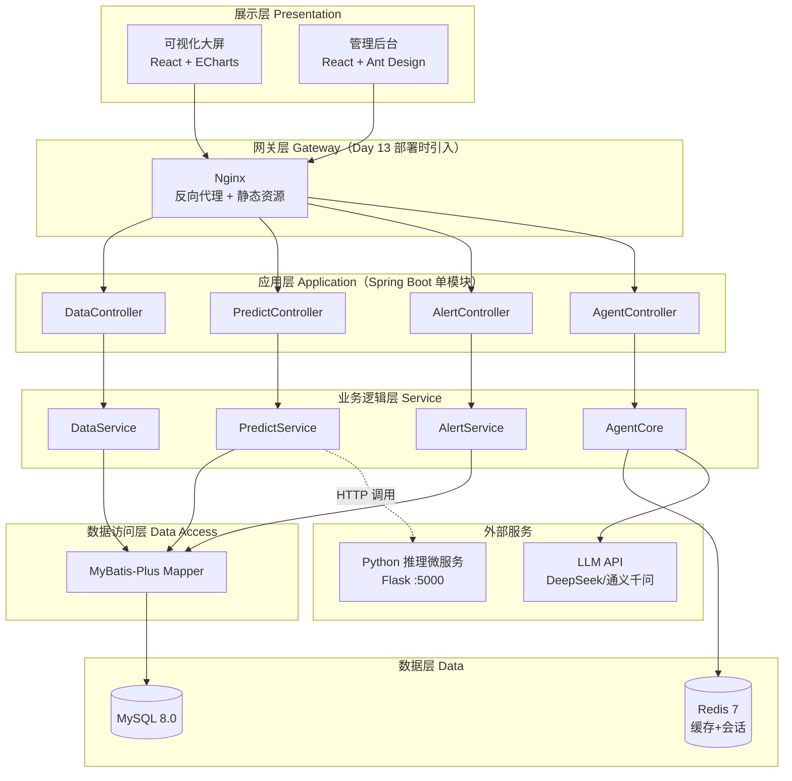
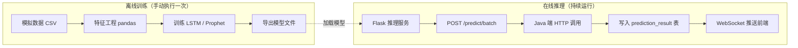
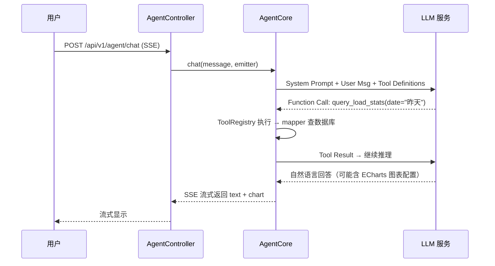
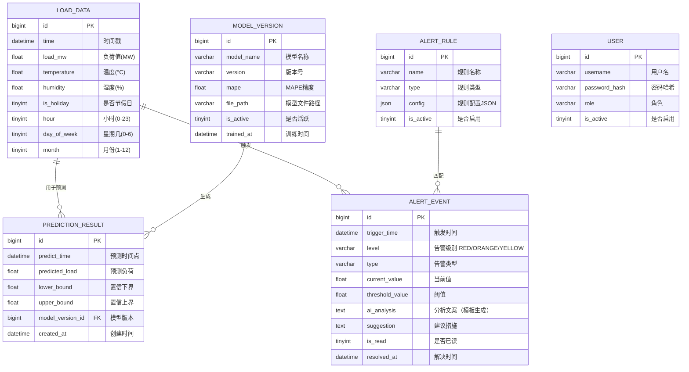

# 🏛️ 电力负荷预测与智能告警 Agent — 系统架构设计

> **版本**：v2.2（精简版） ｜ **日期**：2026-07-10 ｜ **作者**：暑期实训团队（4 人）  
> **配套文档**：[需求规格说明书](./01-需求规格说明书.md) ｜ [技术选型方案](./03-技术选型方案.md)

---

## 目录

1. [架构设计原则](#1-架构设计原则)
2. [系统架构总览](#2-系统架构总览)
3. [模块详细设计](#3-模块详细设计)
4. [数据库设计](#4-数据库设计)
5. [API 接口设计](#5-api-接口设计)
6. [开发与部署](#6-开发与部署)
7. [安全设计](#7-安全设计)

---

## 1. 架构设计原则

| 原则 | 说明 | 实践方式 |
|:-----|:-----|:---------|
| 🎯 **务实优先** | 15 天实训周期内可交付，不过度设计 | 单模块单体 + 先跑通核心链路再横向扩展 |
| 🔗 **核心链路优先** | Day 4 结束前数据 → 展示链路必须贯通 | 模拟数据 → API → 前端曲线图，全链路打通后再加功能 |
| 🔄 **有备选方案** | 每个技术风险点都有 fallback | Flask 微服务主力推理；LSTM 备选 Prophet 基线 |
| 🧩 **模块化** | 各功能模块松耦合，独立开发测试 | 前后端分离 + 后端分层（controller → service → mapper） |
| 🎬 **可演示** | 答辩时功能必须能跑 | 优先 P0 功能，P1 / P2 有余力再加 |

---

## 2. 系统架构总览

### 2.1 分层架构图



### 2.2 技术栈总览

```
┌──────────────────────────────────────────────────────────────┐
│                    前端 (Presentation)                         │
│  React 18 · TypeScript · Vite · ECharts · Ant Design          │
│  Zustand (状态管理) · React Router (路由)                       │
├──────────────────────────────────────────────────────────────┤
│                   后端 (Spring Boot 单模块)                      │
│  Spring Boot 3.3 · JDK 17 · Maven                             │
│  Spring MVC (REST) · Spring WebSocket (实时推送)                │
│  MyBatis-Plus 3.5 (ORM) · Flyway (数据库迁移)                  │
│  SpringDoc OpenAPI + Knife4j (API 文档)                        │
│  OkHttp 4 (LLM API 调用) · Hutool 5.8 (工具集)                 │
│  Spring @Async + @Scheduled (异步 + 定时)                       │
├──────────────────────────────────────────────────────────────┤
│                     ML（训练/推理分离）                           │
│  训练（离线，手动执行）: Python PyTorch / Prophet + pandas        │
│  推理（在线）: Python Flask 微服务（主力）← 备选: DJL             │
├──────────────────────────────────────────────────────────────┤
│                    Agent                                      │
│  DeepSeek / 通义千问 API（OpenAI 兼容格式）                      │
│  自研轻量 Agent 框架（OkHttp + SSE，核心 ~200 行）               │
├──────────────────────────────────────────────────────────────┤
│                    基础设施                                    │
│  Docker Compose（仅 Day 13 部署用）                             │
│  开发阶段: 本地 Java + Docker 起的 MySQL/Redis                   │
└──────────────────────────────────────────────────────────────┘
```

### 2.3 后端包结构（单模块）

```
backend/src/main/java/com/example/
├── PowerLoadApplication.java      # Spring Boot 启动类
├── controller/                     # 控制器层
│   ├── DataController.java
│   ├── PredictController.java
│   ├── AlertController.java
│   └── AgentController.java
├── service/                        # 服务接口
│   ├── DataService.java
│   ├── PredictService.java
│   ├── AlertService.java
│   └── AgentService.java
├── service/impl/                   # 服务实现
│   ├── DataServiceImpl.java
│   ├── PredictServiceImpl.java
│   ├── AlertServiceImpl.java
│   └── AgentServiceImpl.java
├── mapper/                         # MyBatis-Plus Mapper
│   ├── LoadDataMapper.java
│   ├── PredictionResultMapper.java
│   ├── AlertEventMapper.java
│   ├── AlertRuleMapper.java
│   └── ModelVersionMapper.java
├── entity/                         # 实体类（POJO）
│   ├── LoadData.java
│   ├── PredictionResult.java
│   ├── AlertEvent.java
│   ├── AlertRule.java
│   └── ModelVersion.java
├── dto/                            # 数据传输对象
│   ├── request/
│   └── response/
├── agent/                          # LLM Agent 模块
│   ├── AgentCore.java              # 核心编排（~150行）
│   ├── ToolRegistry.java           # 工具注册中心
│   └── tools/                      # Function Calling 工具
│       ├── QueryLoadTool.java      # 查询负荷数据
│       └── GetStatsTool.java       # 获取统计指标
├── ml/                             # ML 推理集成
│   ├── ModelInferenceService.java  # 推理接口
│   └── impl/
│       └── FlaskInferenceService.java  # HTTP 调用 Python 推理服务
├── alert/                          # 告警模块
│   ├── ThresholdDetector.java      # 阈值检测器（P0）
│   ├── TrendDetector.java          # 趋势检测器（P1，有余力做）
│   └── PushService.java            # WebSocket 推送
├── config/                         # 配置类
│   ├── RedisConfig.java
│   ├── SwaggerConfig.java
│   ├── AsyncConfig.java
│   └── WebSocketConfig.java
├── common/                         # 通用组件
│   ├── R.java                      # 统一响应封装
│   ├── GlobalExceptionHandler.java # 全局异常处理
│   └── constant/                   # 常量
└── websocket/                      # WebSocket
    └── DashboardWebSocketHandler.java
```

> **为什么不拆 Maven 多模块？** 15 天项目体量小，多模块增加 pom.xml 管理成本和构建复杂度。单模块打包一个 Jar，Dockerfile 也简单。

---

## 3. 模块详细设计

### 3.1 数据管理模块

```
数据管理模块
├── MockDataGenerator       # 模拟数据生成器（实训核心数据源）
├── CsvFileImporter         # CSV 导入（备选，如果找到公开数据集）
│
├── DataService
│   ├── getLoadData()       # 时间范围查询
│   ├── getLatest()         # 最新负荷值
│   └── getStats()          # 统计（峰值/谷值/均值/负荷率）
│
└── Mapper 层
    ├── LoadDataMapper      # 负荷数据 CRUD（BaseMapper）
    └── WeatherDataMapper   # 气象数据（P2）
```

**数据来源方案**（实训使用）：

| 方案 | 说明 | 推荐 |
|------|------|------|
| 模拟数据生成 | 典型日负荷曲线 + 噪声 + 趋势 + 季节分量合成 | ⭐⭐⭐⭐⭐ **首选，即开即用** |
| 公开数据集 | 某电网公开的负荷数据 | ⭐⭐⭐ 真实但需要清洗 |
| 混合方案 | 公开数据打底 + 模拟补充异常场景 | ⭐⭐⭐⭐ 有额外时间时做 |

**模拟数据生成思路**：一天 24 小时取 24 个点，日负荷曲线呈双峰形态（早高峰 ~10:00 + 晚高峰 ~18:00），叠加上随机噪声、周末偏移、季节性趋势。一个 `MockDataGenerator.java` 约 150 行，跑一次生成 2 年数据（~17,520 条），存入 `load_data` 表。

### 3.2 负荷预测模块

**⚠️ Day 3 第一天验证：先随便跑通一个预测 API，返回假数据都行——验证链路是通的。**

```
预测模块
├── 离线训练脚本（Python，放 ml/ 目录，手动执行一次）
│   ├── train_lstm.py         # LSTM 训练 + 导出 .pt /.onnx（加分项）
│   ├── train_prophet.py      # Prophet 基线（保底方案）
│   └── requirements.txt      # torch, prophet, pandas, scikit-learn, flask
│
├── 在线推理服务（Python Flask，ml/app.py，约 60 行）
│   ├── POST /predict         # 接收特征数组 → 返回预测值
│   └── POST /predict/batch   # 批量预测（24h 一次返回）
│
└── Java 端调用
    ├── ModelInferenceService  # 接口（策略模式）
    ├── FlaskInferenceService  # Http 调用 Python 微服务（主力）
    └── DJLInferenceService    # DJL 原生加载（可选，Flask 翻车时备选）
```

**为什么推荐 Python Flask 微服务而非 DJL？**

| 对比维度 | Flask 微服务 | DJL |
|----------|-------------|-----|
| 环境兼容性 | ✅ Python 装了就能跑 | ❌ Windows/Mac M 系列常有 `UnsatisfiedLinkError` |
| 调试便利性 | ✅ 单独测试 `curl` 一把梭 | ❌ 嵌在 Java 里难定位 |
| 答辩加分 | ⭐⭐⭐ 两个语言协作 | ⭐⭐⭐⭐ 纯 Java 方案 |
| 15 天风险 | 🟢 低 | 🔴 高——卡住可能浪费 2-3 天 |

**训练与推理流程**：



**Flask 推理服务示例**（`ml/app.py`，约 60 行）：

```python
from flask import Flask, request, jsonify
import torch
import numpy as np

app = Flask(__name__)

# 启动时加载模型（只加载一次）
model = torch.jit.load("lstm_model.pt")
model.eval()

@app.route("/predict/batch", methods=["POST"])
def predict_batch():
    """批量预测未来 24 小时"""
    data = request.json           # {"features": [[f1..fn], ...]}
    features = np.array(data["features"], dtype=np.float32)
    tensor = torch.from_numpy(features).unsqueeze(0)
    with torch.no_grad():
        predictions = model(tensor).squeeze().tolist()
    return jsonify({"predictions": predictions})

@app.route("/health")
def health():
    return jsonify({"status": "ok"})

if __name__ == "__main__":
    app.run(host="0.0.0.0", port=5000)
```

**Java 端调用**（`FlaskInferenceService.java`，约 50 行）：

```java
@Service
public class FlaskInferenceService implements ModelInferenceService {

    private final OkHttpClient client = new OkHttpClient();
    private final ObjectMapper mapper = new ObjectMapper();

    @Value("${ml.service.url:http://localhost:5000}")
    private String mlServiceUrl;

    @Override
    public List<Float> predictBatch(List<float[]> features) {
        Map<String, Object> body = Map.of("features", features);
        Request request = new Request.Builder()
            .url(mlServiceUrl + "/predict/batch")
            .post(RequestBody.create(mapper.writeValueAsString(body), 
                     MediaType.parse("application/json")))
            .build();
        try (Response response = client.newCall(request).execute()) {
            JsonNode node = mapper.readTree(response.body().string());
            return mapper.convertValue(node.get("predictions"), 
                   new TypeReference<List<Float>>() {});
        }
    }
}
```

**备选：如果 DJL 在你的环境能跑通**，可以替换为 DJL 直接加载模型，无需启动 Flask 进程。但 **Day 3 第一件事**就是验证 DJL——半天搞不定就切 Flask。

### 3.3 异常检测与告警模块 — 🚫 AI 禁飞区（NFZ-3）

> ⚠️ **AI 禁飞区说明**：告警模块中的 **ThresholdDetector.java** + **AlertTemplate.java**（NFZ-3）为本项目的 AI 禁飞区。AI 工具只允许提供思路参考，**代码必须手写**。

```
告警模块（分阶段交付）
├── 🚫 P0（Sprint 2）: 阈值检测 — NFZ-3 禁飞区 ✍️ 手写
│   └── ThresholdDetector      # 当前值 > 阈值 → 告警（分级逻辑手写）
│
├── P1（Sprint 3，有余力）: 趋势检测
│   └── TrendDetector           # 预测值即将超限 → 预警（加分项）
│
└── 告警引擎（核心，P0 必须）
    ├── LevelClassifier         # 分级: 红(>110%) / 橙(>100%) / 黄(>90%)
    ├── 🚫 AlertTemplate        # NFZ-3 禁飞区：固定模板生成告警文案 ✍️ 手写
    └── PushService             # WebSocket 推送
```

**告警分级规则**：

| 级别 | 颜色 | 触发条件 | 示例 |
|:-----|:-----|:---------|:-----|
| 🔴 紧急 | 红 | 当前负荷 > 安全上限 × 110% | "当前负荷 1250MW 超过安全上限 1200MW 的 110%" |
| 🟠 重要 | 橙 | 当前负荷 > 安全上限 × 100% | "当前负荷 1180MW 超过安全上限 1150MW" |
| 🟡 提示 | 黄 | 当前负荷 > 安全上限 × 90% | "当前负荷 1050MW 接近安全上限 1200MW 的 90%" |

**告警文案用固定模板，不调 LLM**：

```java
// AlertTemplate.java — 固定模板，不依赖 LLM
public class AlertTemplate {
    private static final Map<String, String> TEMPLATES = Map.of(
        "RED",   "⚠️ 紧急告警：当前负荷 %.0fMW，超出安全上限 %.0fMW 的 110%%。建议立即关注负荷变化，必要时启动调峰预案。",
        "ORANGE","🔶 重要告警：当前负荷 %.0fMW，超出安全上限 %.0fMW。建议密切关注负荷趋势。",
        "YELLOW","💡 提示：当前负荷 %.0fMW，接近安全上限 %.0fMW 的 90%%。建议提前关注。"
    );

    public static String generate(String level, float current, float threshold) {
        return String.format(TEMPLATES.getOrDefault(level, ""), current, threshold);
    }
}
```

> **为什么不用 LLM 生成告警文案？** LLM 调用需要 2-5 秒延迟和网络依赖，固定模板毫秒级返回且永远可用。答辩演示时，固定模板效果不差。告警文案 LLM 化可留到 P2。

**告警检测核心逻辑**（P0 版本，约 80 行）：

```java
@Service
public class AlertServiceImpl implements AlertService {

    private final AlertEventMapper alertMapper;
    private final SimpMessagingTemplate wsTemplate;  // WebSocket

    @Async
    @Scheduled(fixedDelay = 60_000)  // 每分钟检测一次
    public void checkAlerts() {
        LoadData latest = dataService.getLatest();
        if (latest == null) return;

        AlertRule rule = ruleService.getActiveThresholdRule();
        float threshold = rule.getThreshold();

        String level = classifyLevel(latest.getLoadMw(), threshold);
        if (level == null) return;  // 未超 90%，不告警

        if (isDuplicate(latest.getTime(), level)) return;  // 同一时段不重复告警

        AlertEvent event = new AlertEvent();
        event.setTriggerTime(latest.getTime());
        event.setLevel(level);
        event.setCurrentValue(latest.getLoadMw());
        event.setThresholdValue(threshold);
        event.setAiAnalysis(AlertTemplate.generate(level, latest.getLoadMw(), threshold));

        alertMapper.insert(event);
        wsTemplate.convertAndSend("/topic/alerts", event);
    }

    private String classifyLevel(float value, float threshold) {
        if (value > threshold * 1.1) return "RED";
        if (value > threshold)      return "ORANGE";
        if (value > threshold * 0.9) return "YELLOW";
        return null;
    }
}
```

### 3.4 智能 Agent 模块 — 🚫 AI 禁飞区核心

> ⚠️ **AI 禁飞区说明**：Agent 模块中的 **AgentCore.java**（NFZ-1）和 **System Prompt + Tool Schema**（NFZ-2）为本项目的 AI 禁飞区。AI 工具只允许提供思路参考，**代码必须手写**。答辩日导师将逐行抽查讲解，无法完整讲解则模块分数清零。

**P0 版本：只做 2 个工具 + 1 个 QueryAgent**

```
Agent 模块（~300 行 Java 总计）
├── 🚫 AgentCore.java           # NFZ-1 禁飞区：核心编排（~150行）✍️ 手写
│   ├── 构造 messages（system prompt + tools schema + history + user msg）
│   ├── 调用 LLM API（OkHttp，OpenAI 兼容格式）
│   ├── 处理 function_call → 执行工具 → 二次调用 LLM
│   └── SSE 流式返回最终结果
│
├── 🚫 buildSystemPrompt()      # NFZ-2 禁飞区：Prompt 工程 ✍️ 手写
│   ├── System Prompt 模板设计
│   └── Tool Definitions Schema 定义
│
├── ToolRegistry.java           # 工具注册（~30行，Spring DI 扫描所有 Tool bean）
│
└── tools/                      # 工具集（P0 只需 2 个）
    ├── QueryLoadTool.java      # "昨天最高负荷是多少？" → 查 load_data 表
    └── GetStatsTool.java       # "本月平均负荷率？" → 统计查询
```

**P1 有余力再加**：`QueryPredictTool`（查预测）、`QueryAlertTool`（查告警）

**P2 砍掉**：告警文案 LLM 生成（用固定模板替代）、多轮对话上下文（单轮就够演示）

**Agent 交互流程**：



**Agent 核心代码骨架**（~120 行）：

```java
@Service
public class AgentCore {

    private final OkHttpClient httpClient = new OkHttpClient();
    private final ToolRegistry toolRegistry;
    private final ObjectMapper objectMapper;

    @Value("${llm.api.key}")
    private String apiKey;
    @Value("${llm.api.url}")
    private String apiUrl;

    public void chat(String message, SseEmitter emitter) {
        // 1. 构造 messages
        List<Map<String, Object>> messages = new ArrayList<>();
        messages.add(Map.of("role", "system", "content", buildSystemPrompt()));
        messages.add(Map.of("role", "user", "content", message));

        // 2. 调用 LLM（带工具定义）
        ChatResponse response = callLLM(messages, toolRegistry.getDefinitions());
        if (response.hasToolCall()) {
            // 3. 执行工具 + 二次调用
            emitter.send(sseEvent("thinking", "正在查询数据..."));
            String toolResult = toolRegistry.execute(response.getToolCall());
            messages.add(buildAssistantMsg(response.getToolCall()));
            messages.add(Map.of("role", "tool", "content", toolResult));
            response = callLLM(messages, null);  // 不带 tools，让 LLM 直接回答
        }

        // 4. 流式返回
        for (String chunk : response.getContent().split("")) {
            emitter.send(sseEvent("text", chunk));
        }
        emitter.complete();
    }

    private ChatResponse callLLM(List<Map<String, Object>> messages, 
                                  List<ToolDefinition> tools) {
        // OkHttp POST → LLM API（OpenAI 兼容格式）
        // 解析 JSON 返回 ChatResponse
    }
}
```

> **为什么自研而不引入 LangChain4j / Spring AI？** Function Calling 核心逻辑不到 200 行，框架学习成本远大于自研。自研白盒——答辩时你可以讲清楚每一行逻辑。

---

## 4. 数据库设计

### 4.1 ER 图



### 4.2 核心表 DDL（MySQL 8.0 + Flyway 迁移）

```sql
-- V1__init_schema.sql
-- 负荷数据表
CREATE TABLE load_data (
    id          BIGINT PRIMARY KEY AUTO_INCREMENT,
    time        DATETIME NOT NULL COMMENT '数据时间点（精确到小时）',
    load_mw     FLOAT NOT NULL COMMENT '负荷值(MW)',
    temperature FLOAT COMMENT '温度(°C)',
    humidity    FLOAT COMMENT '湿度(%)',
    is_holiday  TINYINT DEFAULT 0 COMMENT '是否节假日',
    hour        TINYINT COMMENT '小时(0-23)',
    day_of_week TINYINT COMMENT '星期几(0=周一,6=周日)',
    month       TINYINT COMMENT '月份(1-12)',
    created_at  DATETIME DEFAULT CURRENT_TIMESTAMP,
    UNIQUE INDEX idx_time (time),
    INDEX idx_hour (hour)
) ENGINE=InnoDB DEFAULT CHARSET=utf8mb4 COMMENT='负荷数据表';

-- 预测结果表
CREATE TABLE prediction_result (
    id               BIGINT PRIMARY KEY AUTO_INCREMENT,
    predict_time     DATETIME NOT NULL COMMENT '预测的时间点',
    predicted_load   FLOAT NOT NULL COMMENT '预测负荷值(MW)',
    lower_bound      FLOAT COMMENT '置信区间下界',
    upper_bound      FLOAT COMMENT '置信区间上界',
    model_version_id BIGINT COMMENT '关联模型版本',
    created_at       DATETIME DEFAULT CURRENT_TIMESTAMP,
    INDEX idx_predict_time (predict_time)
) ENGINE=InnoDB DEFAULT CHARSET=utf8mb4 COMMENT='预测结果表';

-- 模型版本表
CREATE TABLE model_version (
    id          BIGINT PRIMARY KEY AUTO_INCREMENT,
    model_name  VARCHAR(100) NOT NULL COMMENT 'LSTM/Prophet',
    version     VARCHAR(20) NOT NULL COMMENT 'v1.0/v2.0',
    mape        FLOAT COMMENT 'MAPE精度(%)',
    file_path   VARCHAR(500) NOT NULL,
    is_active   TINYINT DEFAULT 0,
    trained_at  DATETIME,
    created_at  DATETIME DEFAULT CURRENT_TIMESTAMP,
    INDEX idx_active (is_active)
) ENGINE=InnoDB DEFAULT CHARSET=utf8mb4 COMMENT='模型版本表';

-- 告警规则表
CREATE TABLE alert_rule (
    id        BIGINT PRIMARY KEY AUTO_INCREMENT,
    name      VARCHAR(100) NOT NULL COMMENT '规则名称',
    type      VARCHAR(50) NOT NULL COMMENT 'THRESHOLD/TREND/ANOMALY',
    config    JSON NOT NULL COMMENT '{"threshold": 1200}',
    is_active TINYINT DEFAULT 1,
    created_at DATETIME DEFAULT CURRENT_TIMESTAMP,
    updated_at DATETIME DEFAULT CURRENT_TIMESTAMP ON UPDATE CURRENT_TIMESTAMP
) ENGINE=InnoDB DEFAULT CHARSET=utf8mb4 COMMENT='告警规则表';

-- 告警事件表
CREATE TABLE alert_event (
    id              BIGINT PRIMARY KEY AUTO_INCREMENT,
    trigger_time    DATETIME NOT NULL,
    level           VARCHAR(10) NOT NULL COMMENT 'RED/ORANGE/YELLOW',
    type            VARCHAR(20) NOT NULL COMMENT 'THRESHOLD/TREND/ANOMALY',
    current_value   FLOAT,
    threshold_value FLOAT,
    rule_id         BIGINT,
    ai_analysis     TEXT COMMENT '告警分析文案',
    suggestion      TEXT COMMENT '建议措施',
    is_read         TINYINT DEFAULT 0,
    resolved_at     DATETIME,
    created_at      DATETIME DEFAULT CURRENT_TIMESTAMP,
    INDEX idx_trigger_time (trigger_time),
    INDEX idx_level (level),
    INDEX idx_is_read (is_read)
) ENGINE=InnoDB DEFAULT CHARSET=utf8mb4 COMMENT='告警事件表';

-- 用户表（P2 做登录时才用）
CREATE TABLE user (
    id            BIGINT PRIMARY KEY AUTO_INCREMENT,
    username      VARCHAR(50) NOT NULL UNIQUE,
    password_hash VARCHAR(255) NOT NULL,
    role          VARCHAR(20) NOT NULL DEFAULT 'DISPATCHER',
    is_active     TINYINT DEFAULT 1,
    created_at    DATETIME DEFAULT CURRENT_TIMESTAMP,
    updated_at    DATETIME DEFAULT CURRENT_TIMESTAMP ON UPDATE CURRENT_TIMESTAMP
) ENGINE=InnoDB DEFAULT CHARSET=utf8mb4 COMMENT='用户表';

-- 种子数据: 默认管理员 (P2 启用)
-- INSERT INTO user (username, password_hash, role) VALUES
-- ('admin', '$2a$10$...', 'ADMIN');
```

### 4.3 索引策略

| 表 | 索引名 | 索引列 | 用途 |
|:---|:-------|:-------|:-----|
| load_data | `idx_time` (UNIQUE) | time | 按时间查询负荷（最频繁） |
| load_data | `idx_hour` | hour | 按小时聚合统计 |
| prediction_result | `idx_predict_time` | predict_time | 查询未来 24h 预测 |
| alert_event | `idx_trigger_time` | trigger_time | 告警时间线查询 |
| alert_event | `idx_level` | level | 按告警级别筛选 |

---

## 5. API 接口设计

### 5.1 接口概览（分阶段）

```
/api/v1/

P0（Day 4-8，必须交付）:
├── /data
│   ├── GET    /load?start=&end=         # 时间范围查询负荷
│   ├── GET    /load/latest              # 最新负荷值
│   └── GET    /load/stats               # 统计（峰值/谷值/均值/负荷率）
├── /predict
│   └── GET    /forecast                  # 获取最新 24h 预测
├── /alert
│   ├── GET    /events                    # 告警列表（分页）
│   └── PUT    /events/{id}/read         # 标记已读
├── /agent
│   └── POST   /chat                      # NL 对话（SSE 流式）
└── /system
    └── GET    /health                    # 健康检查

P1（Day 9-12，有余力）:
├── /predict/accuracy                     # 预测精度统计
├── /alert/rules + PUT /alert/rules/{id} # 告警规则管理
└── /model/versions                       # 模型版本列表

P2（Day 13+，加分项）:
├── /auth/login + /auth/refresh           # JWT 认证
└── /system/logs                          # 操作日志
```

### 5.2 统一响应格式

```java
// R.java — 统一响应
@Data
public class R<T> {
    private int code;       // 0=成功, 非0=失败
    private String message;
    private T data;
    private long timestamp;

    public static <T> R<T> ok(T data) {
        R<T> r = new R<>();
        r.code = 0; r.message = "success";
        r.data = data; r.timestamp = System.currentTimeMillis();
        return r;
    }

    public static <T> R<T> error(int code, String message) {
        R<T> r = new R<>();
        r.code = code; r.message = message;
        r.timestamp = System.currentTimeMillis();
        return r;
    }
}
```

### 5.3 核心接口示例

#### GET /api/v1/data/load

```
请求: GET /api/v1/data/load?start=2024-01-01T00:00:00&end=2024-01-02T00:00:00

响应:
{
  "code": 0,
  "message": "success",
  "data": [
    {"time": "2024-01-01T00:00:00", "loadMw": 850.3, "temperature": 5.2},
    {"time": "2024-01-01T01:00:00", "loadMw": 820.1, "temperature": 4.8}
  ],
  "timestamp": 1704067200000
}
```

#### POST /api/v1/agent/chat（SSE 流式）

```
请求: { "message": "昨天最高负荷出现在几点？比前天高了多少？" }

响应 (SSE 流式):
  event: thinking
  data: {"content": "正在查询昨日负荷数据..."}

  event: text
  data: {"content": "昨日最高负荷出现在 18:30，达到 1250MW，较前日最高值 1180MW 增长了 5.9%。"}

  event: chart
  data: {"config": {"xAxis": {...}, "series": [...]}}

  event: done
  data: {}
```

#### WebSocket /ws/dashboard

```
服务端 → 客户端推送:
{
  "type": "load_update",       // load_update | alert | prediction
  "data": {
    "time": "2024-01-01T10:00:00",
    "loadMw": 1100.5
  }
}
```

### 5.4 MyBatis-Plus 实体映射示例

```java
// LoadData.java
@Data
@TableName("load_data")
public class LoadData {
    @TableId(type = IdType.AUTO)
    private Long id;
    private LocalDateTime time;
    private Float loadMw;
    private Float temperature;
    private Float humidity;
    private Integer isHoliday;
    private Integer hour;
    private Integer dayOfWeek;
    private Integer month;
}

// LoadDataMapper.java — BaseMapper 已提供 selectList/insert/updateById/deleteById
@Mapper
public interface LoadDataMapper extends BaseMapper<LoadData> {
    @Select("SELECT * FROM load_data WHERE time BETWEEN #{start} AND #{end} ORDER BY time")
    List<LoadData> selectByTimeRange(@Param("start") LocalDateTime start,
                                     @Param("end") LocalDateTime end);
}
```

---

## 6. 开发与部署

### 6.1 开发阶段（Day 3-12）：轻量本地环境

**不要用 Docker Compose 开发**——每次改代码 rebuild 镜像太慢。

```
开发工作流:
1. Docker 只起 MySQL + Redis（一条命令）
   docker run -d --name mysql-dev -p 3306:3306 -e MYSQL_ROOT_PASSWORD=root -e MYSQL_DATABASE=power_load mysql:8.0
   docker run -d --name redis-dev -p 6379:6379 redis:7-alpine

2. Backend: mvn spring-boot:run（或 IDE 直接 Run）
   → localhost:8080，Spring Boot DevTools 可选

3. Frontend: npm run dev（Vite HMR 秒级热更新）
   → localhost:5173

4. ML 推理: python ml/app.py
   → localhost:5000
```

### 6.2 部署阶段（Day 13）：Docker Compose 一把梭

```yaml
# docker-compose.yml — 只在 Day 13 部署时使用
version: '3.8'
services:
  nginx:
    image: nginx:alpine
    ports:
      - "80:80"
    volumes:
      - ./nginx.conf:/etc/nginx/nginx.conf:ro
    depends_on:
      - backend

  backend:
    build:
      context: ./backend
      dockerfile: Dockerfile
    ports:
      - "8080:8080"
    environment:
      - SPRING_PROFILES_ACTIVE=docker
      - MYSQL_HOST=mysql
      - REDIS_HOST=redis
      - ML_SERVICE_URL=http://ml-inference:5000
    depends_on:
      mysql:
        condition: service_healthy
      redis:
        condition: service_started

  frontend:
    build:
      context: ./frontend
      dockerfile: Dockerfile
    depends_on:
      - backend

  mysql:
    image: mysql:8.0
    environment:
      MYSQL_ROOT_PASSWORD: ${MYSQL_ROOT_PASSWORD}
      MYSQL_DATABASE: power_load
    ports:
      - "3306:3306"
    volumes:
      - mysql-data:/var/lib/mysql
    healthcheck:
      test: ["CMD", "mysqladmin", "ping", "-h", "localhost"]
      interval: 10s
      retries: 5

  redis:
    image: redis:7-alpine
    ports:
      - "6379:6379"

  ml-inference:
    build:
      context: ./ml
      dockerfile: Dockerfile
    ports:
      - "5000:5000"

volumes:
  mysql-data:
```

### 6.3 后端 Dockerfile（多阶段构建）

```dockerfile
# 构建阶段
FROM maven:3.9-eclipse-temurin-17-alpine AS builder
WORKDIR /app
COPY pom.xml .
RUN mvn dependency:go-offline -B
COPY src/ src/
RUN mvn package -DskipTests

# 运行阶段
FROM eclipse-temurin:17-jre-alpine
WORKDIR /app
COPY --from=builder /app/target/*.jar app.jar
EXPOSE 8080
ENTRYPOINT ["java", "-jar", "app.jar"]
```

### 6.4 CI/CD（GitHub Actions，骨架就够）

```yaml
# .github/workflows/ci.yml
name: CI
on: [push, pull_request]
jobs:
  backend:
    runs-on: ubuntu-latest
    steps:
      - uses: actions/checkout@v4
      - uses: actions/setup-java@v4
        with:
          java-version: '17'
          distribution: 'temurin'
      - run: cd backend && mvn test
  frontend:
    runs-on: ubuntu-latest
    steps:
      - uses: actions/checkout@v4
      - uses: actions/setup-node@v4
        with:
          node-version: '20'
      - run: cd frontend && npm ci && npm run lint && npx vitest run
```

---

## 7. 安全设计（P2，Day 10+ 有余力再做）

> **Day 4-9 阶段所有 API 裸奔**，先把核心功能跑通。演示时没人测你的登录，但所有人都会看大屏和预测曲线。

| 层面 | 措施 | 阶段 |
|:-----|:-----|:----:|
| 🔐 认证鉴权 | Spring Security + JWT（`OncePerRequestFilter` 校验） | P2 |
| 🔑 密码存储 | BCryptPasswordEncoder | P2 |
| 🗝️ 密钥管理 | `.env` 文件，已配 `.gitignore` | P0 |
| 🛡️ SQL 注入防护 | MyBatis-Plus `#{}` 参数化查询 | P0（自动） |
| ✅ 输入校验 | `@Valid` + DTO 校验注解 | P0 |
| 🌐 CORS | 前端域名白名单 | P0（否则联调不通） |
| 📝 日志 | Logback 结构化日志 | P1 |

---

## 附录：分阶段交付优先级

| 优先级 | 时间 | 功能 | 理由 |
|:-------|:-----|:-----|:-----|
| 🔴 **P0** 必须 | Day 4–8 | 数据查询 API + 负荷曲线 + Prophet 预测 + 阈值告警 + 统计卡片 + Agent 基础 NL 查询 | 核心链路，缺一个演示就不完整 |
| 🟠 **P1** 尽量 | Day 9–12 | LSTM 预测 + WebSocket 实时推送 + 大屏自适应 + 告警规则配置页 | 答辩亮点，差异化的关键 |
| 🟢 **P2** 加分 | Day 13–15 | JWT 认证 + Agent 多轮对话 + 模型版本管理 + 模型精度监控页面 | 锦上添花，有余力再做 |
| ⬛ **砍掉** | — | 告警文案 LLM 生成、3-sigma 检测器、天气数据关联、用户管理 | 时间黑洞，性价比极低 |

---

> **文档审批**
>
> | 角色（Scrum） | 签字 | 日期 |
> |:-------------|:-----|:-----|
> | 项目经理（SM） | | |
> | 技术经理（Dev） | | |
> | 产品经理（PO） | | |
> | 测试工程师（QA） | | |
