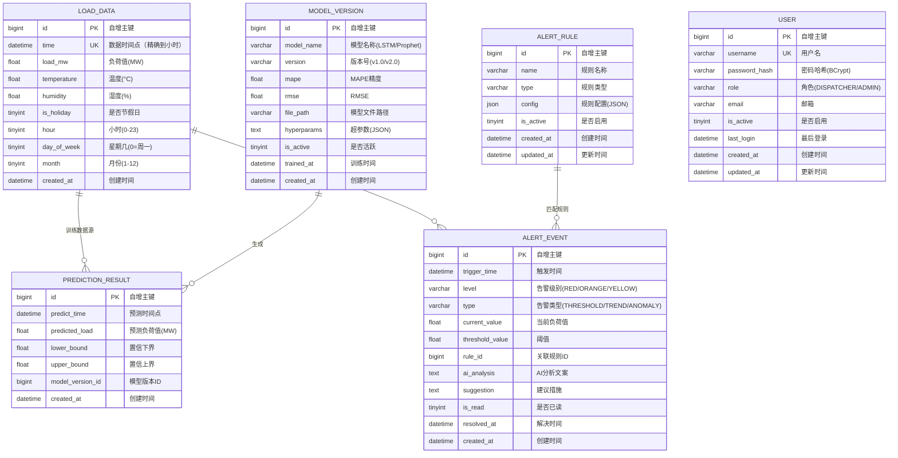

# 🗄️ 电力负荷预测与智能告警 Agent — 数据模型设计

> **版本**：v1.0 ｜ **日期**：2026-07-10 ｜ **作者**：技术经理  
> **配套文档**：[系统架构设计](./02-系统架构设计.md) ｜ [接口设计文档](./04-接口设计文档.md)  
> 📄 **5 项人工产出 D3**

---

## 目录

1. [设计概述](#1-设计概述)
2. [ER 图](#2-er-图)
3. [核心表设计](#3-核心表设计)
4. [索引策略](#4-索引策略)
5. [数据字典](#5-数据字典)
6. [模拟数据说明](#6-模拟数据说明)
7. [Flyway 迁移方案](#7-flyway-迁移方案)

---

## 1. 设计概述

### 1.1 数据库信息

| 项目 | 选型 |
|:-----|:-----|
| 数据库 | MySQL 8.0 |
| 引擎 | InnoDB |
| 字符集 | utf8mb4 |
| 排序规则 | utf8mb4_general_ci |
| 时区 | Asia/Shanghai (UTC+8) |
| 迁移工具 | Flyway 10.15 |
| ORM | MyBatis-Plus 3.5.7 |

### 1.2 表清单

| 表名 | 说明 | 预估行数 | 优先级 |
|:-----|:-----|:---------|:------:|
| `load_data` | 历史负荷数据 | ~17,520 行（2 年 × 24h） | P0 |
| `prediction_result` | 预测结果 | ~720 行（30 天 × 24h） | P0 |
| `alert_event` | 告警事件 | ~500 行 | P0 |
| `alert_rule` | 告警规则 | ~10 行 | P0 |
| `model_version` | 模型版本 | ~5 行 | P0 |
| `user` | 用户表 | ~5 行 | P2 |

### 1.3 命名规范

| 规范 | 示例 |
|:-----|:-----|
| 表名：小写 + 下划线分隔 | `load_data`, `alert_event` |
| 字段名：小写 + 下划线分隔 | `load_mw`, `trigger_time` |
| 主键：统一 `id` | `id BIGINT PRIMARY KEY AUTO_INCREMENT` |
| 索引名：`idx_` + 字段名 | `idx_time`, `idx_level` |
| 外键关联用逻辑字段，不加物理外键 | `model_version_id BIGINT` |
| 时间戳字段统一命名 | `created_at`, `updated_at`, `resolved_at` |
| 布尔用小整数 | `TINYINT DEFAULT 0` |

---

## 2. ER 图



---

## 3. 核心表设计

### 3.1 `load_data` — 历史负荷数据表

**用途**：存储逐小时负荷数据，是预测模型的唯一数据源。所有数据查询、统计、大屏展示都基于此表。

```sql
CREATE TABLE load_data (
    id          BIGINT PRIMARY KEY AUTO_INCREMENT COMMENT '自增主键',
    time        DATETIME NOT NULL COMMENT '数据时间点（精确到小时）',
    load_mw     FLOAT NOT NULL COMMENT '负荷值(MW)',
    temperature FLOAT COMMENT '温度(°C)',
    humidity    FLOAT COMMENT '湿度(%)',
    is_holiday  TINYINT DEFAULT 0 COMMENT '是否节假日(0=否,1=是)',
    hour        TINYINT COMMENT '小时(0-23)',
    day_of_week TINYINT COMMENT '星期几(0=周一,6=周日)',
    month       TINYINT COMMENT '月份(1-12)',
    created_at  DATETIME DEFAULT CURRENT_TIMESTAMP COMMENT '创建时间',

    UNIQUE INDEX idx_time (time),
    INDEX idx_hour (hour),
    INDEX idx_day_of_week (day_of_week),
    INDEX idx_month (month)
) ENGINE=InnoDB DEFAULT CHARSET=utf8mb4 COMMENT='历史负荷数据表';
```

| 字段 | 类型 | 必填 | 说明 |
|:-----|:-----|:----:|:-----|
| id | BIGINT | ✅ | 自增主键 |
| time | DATETIME | ✅ | 数据时间点，精确到小时。UNIQUE 约束防止重复导入 |
| load_mw | FLOAT | ✅ | 负荷值，单位 MW。允许小数 |
| temperature | FLOAT | ❌ | 温度，可为空（无气象数据时） |
| humidity | FLOAT | ❌ | 湿度，可为空 |
| is_holiday | TINYINT | ✅ | 0=非节假日，1=节假日。默认 0 |
| hour | TINYINT | ✅ | 冗余字段，加速按小时聚合查询 |
| day_of_week | TINYINT | ✅ | 冗余字段，加速按星期聚合 |
| month | TINYINT | ✅ | 冗余字段，加速按月份聚合 |

> **设计说明**：`hour`、`day_of_week`、`month` 为冗余字段。虽然可从 `time` 计算得出，但预计算存储可显著加速统计聚合查询（如"计算每天 18:00 的平均负荷"）。

---

### 3.2 `prediction_result` — 预测结果表

```sql
CREATE TABLE prediction_result (
    id               BIGINT PRIMARY KEY AUTO_INCREMENT COMMENT '自增主键',
    predict_time     DATETIME NOT NULL COMMENT '预测的时间点',
    predicted_load   FLOAT NOT NULL COMMENT '预测负荷值(MW)',
    lower_bound      FLOAT COMMENT '置信区间下界',
    upper_bound      FLOAT COMMENT '置信区间上界',
    model_version_id BIGINT COMMENT '关联模型版本ID',
    created_at       DATETIME DEFAULT CURRENT_TIMESTAMP COMMENT '预测生成时间',

    INDEX idx_predict_time (predict_time),
    INDEX idx_created_at (created_at)
) ENGINE=InnoDB DEFAULT CHARSET=utf8mb4 COMMENT='预测结果表';
```

| 字段 | 类型 | 必填 | 说明 |
|:-----|:-----|:----:|:-----|
| predict_time | DATETIME | ✅ | 预测所针对的未来时间点 |
| predicted_load | FLOAT | ✅ | 预测的负荷值 |
| lower_bound | FLOAT | ❌ | 80% 置信区间下界（Prophet 输出） |
| upper_bound | FLOAT | ❌ | 80% 置信区间上界 |
| model_version_id | BIGINT | ❌ | 关联 model_version.id，追溯预测来源 |

> **存储策略**：每次模型推理生成 24h 预测 → INSERT 24 条。前端取 `created_at` 最大的 24 条即为最新预测。历史预测保留用于精度对比。

---

### 3.3 `alert_event` — 告警事件表

```sql
CREATE TABLE alert_event (
    id              BIGINT PRIMARY KEY AUTO_INCREMENT COMMENT '自增主键',
    trigger_time    DATETIME NOT NULL COMMENT '触发时间',
    level           VARCHAR(10) NOT NULL COMMENT '告警级别: RED/ORANGE/YELLOW',
    type            VARCHAR(20) NOT NULL DEFAULT 'THRESHOLD' COMMENT '告警类型: THRESHOLD/TREND/ANOMALY',
    current_value   FLOAT COMMENT '当前负荷值(MW)',
    threshold_value FLOAT COMMENT '触发阈值(MW)',
    rule_id         BIGINT COMMENT '关联告警规则ID',
    ai_analysis     TEXT COMMENT 'AI 分析文案（模板生成）',
    suggestion      TEXT COMMENT '建议措施',
    is_read         TINYINT DEFAULT 0 COMMENT '是否已读(0=未读,1=已读)',
    resolved_at     DATETIME COMMENT '告警解决时间',
    created_at      DATETIME DEFAULT CURRENT_TIMESTAMP COMMENT '创建时间',

    INDEX idx_trigger_time (trigger_time),
    INDEX idx_level (level),
    INDEX idx_is_read (is_read),
    INDEX idx_type (type)
) ENGINE=InnoDB DEFAULT CHARSET=utf8mb4 COMMENT='告警事件表';
```

| 字段 | 类型 | 必填 | 说明 |
|:-----|:-----|:----:|:-----|
| level | VARCHAR(10) | ✅ | 仅允许 RED / ORANGE / YELLOW |
| type | VARCHAR(20) | ✅ | THRESHOLD（阈值告警）/ TREND（趋势预警）/ ANOMALY（异常检测） |
| ai_analysis | TEXT | ❌ | 🚫 禁飞区 NFZ-3 — AlertTemplate 手写模板生成 |
| suggestion | TEXT | ❌ | 建议措施，可选，P1 阶段补充 |
| resolved_at | DATETIME | ❌ | 告警解决时间，NULL 表示未解决 |

> **去重逻辑**：同一小时内同一 level 不重复插入（Service 层 `isDuplicate()` 方法检查）。

---

### 3.4 `alert_rule` — 告警规则表

```sql
CREATE TABLE alert_rule (
    id         BIGINT PRIMARY KEY AUTO_INCREMENT COMMENT '自增主键',
    name       VARCHAR(100) NOT NULL COMMENT '规则名称',
    type       VARCHAR(50) NOT NULL DEFAULT 'THRESHOLD' COMMENT '规则类型',
    config     JSON NOT NULL COMMENT '规则配置(JSON格式)',
    is_active  TINYINT DEFAULT 1 COMMENT '是否启用(0=禁用,1=启用)',
    created_at DATETIME DEFAULT CURRENT_TIMESTAMP,
    updated_at DATETIME DEFAULT CURRENT_TIMESTAMP ON UPDATE CURRENT_TIMESTAMP,

    INDEX idx_active (is_active)
) ENGINE=InnoDB DEFAULT CHARSET=utf8mb4 COMMENT='告警规则表';
```

**`config` JSON 字段示例**：

```json
{
  "threshold": 1200,
  "redRatio": 1.10,
  "orangeRatio": 1.00,
  "yellowRatio": 0.90,
  "coolingTime": 3600
}
```

| 配置项 | 说明 | 默认值 |
|:-------|:-----|:------:|
| threshold | 安全上限 (MW) | 1200 |
| redRatio | 红色告警系数 | 1.10 |
| orangeRatio | 橙色告警系数 | 1.00 |
| yellowRatio | 黄色告警系数 | 0.90 |
| coolingTime | 冷却时间（秒），防重复告警 | 3600 |

---

### 3.5 `model_version` — 模型版本表

```sql
CREATE TABLE model_version (
    id          BIGINT PRIMARY KEY AUTO_INCREMENT COMMENT '自增主键',
    model_name  VARCHAR(100) NOT NULL COMMENT '模型名称(LSTM/Prophet)',
    version     VARCHAR(20) NOT NULL COMMENT '版本号(v1.0/v2.0)',
    mape        FLOAT COMMENT 'MAPE精度(%)',
    rmse        FLOAT COMMENT 'RMSE',
    file_path   VARCHAR(500) NOT NULL COMMENT '模型文件路径',
    hyperparams TEXT COMMENT '超参数(JSON)',
    is_active   TINYINT DEFAULT 0 COMMENT '是否活跃(同时只有一个活跃)',
    trained_at  DATETIME COMMENT '训练完成时间',
    created_at  DATETIME DEFAULT CURRENT_TIMESTAMP,

    INDEX idx_active (is_active)
) ENGINE=InnoDB DEFAULT CHARSET=utf8mb4 COMMENT='模型版本表';
```

**`hyperparams` JSON 字段示例**：

```json
{
  "lstm": {
    "hidden_size": 128,
    "num_layers": 2,
    "dropout": 0.2,
    "learning_rate": 0.001,
    "batch_size": 64,
    "epochs": 100,
    "seq_length": 168
  }
}
```

---

### 3.6 `user` — 用户表（P2）

```sql
CREATE TABLE user (
    id            BIGINT PRIMARY KEY AUTO_INCREMENT,
    username      VARCHAR(50) NOT NULL UNIQUE COMMENT '用户名',
    password_hash VARCHAR(255) NOT NULL COMMENT 'BCrypt密码哈希',
    role          VARCHAR(20) NOT NULL DEFAULT 'DISPATCHER' COMMENT '角色',
    email         VARCHAR(100) COMMENT '邮箱',
    is_active     TINYINT DEFAULT 1 COMMENT '是否启用',
    last_login    DATETIME COMMENT '最后登录时间',
    created_at    DATETIME DEFAULT CURRENT_TIMESTAMP,
    updated_at    DATETIME DEFAULT CURRENT_TIMESTAMP ON UPDATE CURRENT_TIMESTAMP,

    UNIQUE INDEX idx_username (username)
) ENGINE=InnoDB DEFAULT CHARSET=utf8mb4 COMMENT='用户表';
```

**种子数据**（P2 阶段启用）：
```sql
INSERT INTO user (username, password_hash, role, email) VALUES
('admin', '$2a$10$...', 'ADMIN', 'admin@power-load.local'),
('dispatcher', '$2a$10$...', 'DISPATCHER', 'disp@power-load.local');
```

---

## 4. 索引策略

| 表 | 索引名 | 类型 | 索引列 | 查询场景 |
|:---|:-------|:-----|:-------|:---------|
| load_data | `idx_time` | UNIQUE | time | `WHERE time BETWEEN ? AND ?` |
| load_data | `idx_hour` | INDEX | hour | `GROUP BY hour` 聚合 |
| load_data | `idx_day_of_week` | INDEX | day_of_week | 周末 vs 工作日对比 |
| load_data | `idx_month` | INDEX | month | 月度统计 |
| prediction_result | `idx_predict_time` | INDEX | predict_time | 查询未来 24h 预测 |
| prediction_result | `idx_created_at` | INDEX | created_at | 取最新一批预测 |
| alert_event | `idx_trigger_time` | INDEX | trigger_time | 告警时间线 |
| alert_event | `idx_level` | INDEX | level | 按级别筛选 |
| alert_event | `idx_is_read` | INDEX | is_read | 未读告警计数 |
| alert_rule | `idx_active` | INDEX | is_active | 查询启用规则 |
| model_version | `idx_active` | INDEX | is_active | 查询活跃模型 |
| user | `idx_username` | UNIQUE | username | 登录查询 |

### 索引设计原则

- **最频繁查询优先**：`load_data.time` 的 `BETWEEN` 查询是最高频操作，设为 UNIQUE 索引
- **覆盖查询避免回表**：高频统计查询（hour/day/month 聚合）建立冗余字段 + 索引
- **低基数列不建索引**：`is_read` 只有 0/1，但单独索引在 `WHERE is_read=0` 时有效
- **不超过 5 个索引 / 表**：避免写入性能下降

---

## 5. 数据字典

### 5.1 告警级别枚举

| 值 | 中文 | 颜色 | 触发条件 |
|:---|:-----|:----:|:---------|
| RED | 紧急 | 🔴 `#F5222D` | 当前值 > threshold × 110% |
| ORANGE | 重要 | 🟠 `#FA8C16` | 当前值 > threshold × 100% |
| YELLOW | 提示 | 🟡 `#FADB14` | 当前值 > threshold × 90% |

### 5.2 告警类型枚举

| 值 | 说明 | 优先级 |
|:---|:-----|:------:|
| THRESHOLD | 阈值告警（当前值超限） | P0 |
| TREND | 趋势预警（预测值将超限） | P1 |
| ANOMALY | 异常检测（3-sigma / IQR） | P2 |

### 5.3 用户角色枚举

| 值 | 说明 | 权限范围 |
|:---|:-----|:---------|
| ADMIN | 系统管理员 | 全部权限 |
| DISPATCHER | 电力调度员 | 查看大屏 + 告警 + 查询数据 |

### 5.4 模型名称枚举

| 值 | 说明 |
|:---|:-----|
| LSTM | 深度学习 LSTM 模型（主模型） |
| Prophet | Meta Prophet 基线模型（保底） |

---

## 6. 模拟数据说明

### 6.1 生成策略

```python
# generate_mock_data.py 核心逻辑
# 日负荷曲线 = 双峰形态 + 随机噪声 + 周末偏移 + 季节性趋势

for day in range(730):  # 2 年
    for hour in range(24):
        base = get_hourly_pattern(hour)      # 双峰：早 10:00 + 晚 18:00
        noise = random.gauss(0, 30)           # 高斯噪声 σ=30MW
        weekend_discount = 0.85 if is_weekend(day) else 1.0
        seasonal = 1.0 + 0.15 * sin(2π * day / 365)  # 夏高冬低
        
        load = (base * weekend_discount * seasonal) + noise
```

### 6.2 数据特征

| 特征 | 值 |
|:-----|:---|
| 数据周期 | 2 年（730 天） |
| 数据粒度 | 逐小时（24 点 / 天） |
| 总数据量 | ~17,520 行 |
| 负荷范围 | 600 – 1600 MW |
| 峰值时段 | 10:00（早高峰）+ 18:00（晚高峰） |
| 谷值时段 | 04:00（凌晨） |
| 周末系数 | ×0.85 |
| 季节趋势 | 夏季高、冬季低（±15%） |

---

## 7. Flyway 迁移方案

### 7.1 迁移文件命名

```
backend/src/main/resources/db/migration/
├── V1__init_schema.sql          # Day 2: 全部建表语句（P0 表）
├── V2__seed_alert_rules.sql     # Day 9: 种子告警规则
├── V3__add_user_table.sql       # Day 14: 用户表（P2）
└── V4__add_indexes.sql          # Day 13: 性能优化索引
```

### 7.2 V1 迁移内容

- ✅ `load_data` 建表
- ✅ `prediction_result` 建表
- ✅ `alert_event` 建表
- ✅ `alert_rule` 建表
- ✅ `model_version` 建表
- ❌ `user` 表（P2 阶段 V3 添加）

### 7.3 回滚策略

采用 **Flyway Repair + 新迁移** 策略（推荐 15 天项目使用）：

1. 开发阶段：`DROP DATABASE` → 重建 → `mvn flyway:migrate`
2. 生产环境：不删库，只追加新迁移（Flyway 正向迁移原则）

---

## 附录：表大小估算

| 表 | 行数 | 行大小 | 总大小 | 索引大小 |
|:---|:-----|:------:|:------:|:--------:|
| load_data | 17,520 | ~80 B | ~1.4 MB | ~0.5 MB |
| prediction_result | 720 | ~60 B | ~43 KB | ~20 KB |
| alert_event | ~500 | ~500 B | ~250 KB | ~50 KB |
| alert_rule | ~10 | ~300 B | ~3 KB | ~1 KB |
| model_version | ~5 | ~500 B | ~2.5 KB | ~1 KB |
| user | ~5 | ~300 B | ~1.5 KB | ~1 KB |
| **合计** | ~18,760 | — | **~1.7 MB** | **~0.6 MB** |

> 📊 数据量极轻，MySQL 单表查询无任何性能压力。索引策略主要面向答辩展示的查询场景优化。

---

> **文档审批**
>
> | 角色（Scrum） | 签字 | 日期 |
> |:-------------|:-----|:-----|
> | 项目经理（SM） | | |
> | 技术经理（Dev） | | |
> | 产品经理（PO） | | |
> | 测试工程师（QA） | | |
