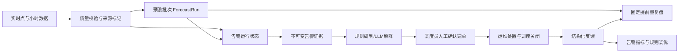
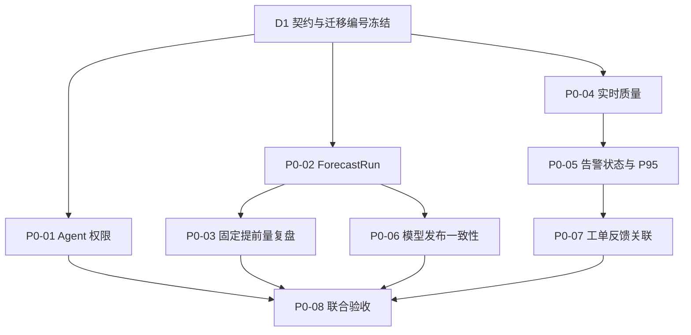

# 电力负荷预测与智能告警 Agent - 下一阶段改善计划

> **版本**：v1.0
> **制定日期**：2026-07-23
> **事实基线**：`develop` 分支当前代码、Flyway V1-V15、`docs/14-当前实现同步说明.md`
> **计划周期假设**：6 个工作日，4 人并行，共 24 人日
> **阶段定位**：在不接入真实 SCADA、不扩大系统架构的前提下，把现有演示链路加固为可追溯、可恢复、可审计的调度辅助闭环

## 1. 当前基线与核心问题

### 1.1 已核实的实现基线

以下能力已存在，下一阶段只做加固或补齐，不重复建设：

- 后端是单模块 Spring Boot，已启用 JWT、方法级角色控制、MyBatis-Plus、Flyway、Redis、操作审计和 WebSocket。
- 前端已按 `DISPATCHER`、`OPERATOR`、`SYSTEM_ADMIN` 区分导航、页面和工单操作。
- Agent 已有 SSE、多轮工具调用、会话归属、Markdown/图表持久化和数据来源说明。
- 告警已有阈值判断、连续超限、冷却、恢复死区、维护模式、暂挂、级别升级、确认、恢复和根告警去重。
- 红色告警只生成前端待确认草稿；正式工单必须由调度员调用创建接口。
- 工单已有创建、指派、认领、开始、解决、关闭、取消、SLA 展示和操作时间线。
- 预测已有 LSTM、未来天气输入、节点预测、结果持久化、质量摘要和线上 MAPE/RMSE/MAE 复盘。
- 模型训练任务已有持久化记录和产物完整性校验，模型页能区分数据库发布版本与 Flask 运行模型。
- 实时数据已有秒级模拟、内存环形缓存、REST 快照补偿、WebSocket 重连和前端时间戳去重。
- 拓扑风险与场景推演是确定性模拟规则，页面和返回数据已明确标记为模拟结果。

### 1.2 核心问题与代码依据

| 问题 | 当前事实依据 | 业务风险 |
|:-----|:-------------|:---------|
| Agent 工具没有硬权限边界 | `AgentCore` 调用无角色参数的 `ToolRegistry.getToolDefinitions()`；`ToolRegistry.execute()` 只按名称分派；`Tool` 没有角色声明。`SecurityConfig` 对 `/agent/chat` 仅要求已认证 | 普通认证用户可能诱导 LLM 调用 `query_admin_audit_summary` 等越权工具；System Prompt 不能作为授权机制 |
| Agent 工具调用未形成专门审计 | `AuditAspect` 只覆盖带 `@AuditLog` 的 HTTP/Service 方法；Agent 工具执行没有记录允许/拒绝、工具名和耗时 | 无法证明越权被拒绝，也无法追踪敏感查询 |
| 预测批次靠时间戳隐式识别 | `PredictServiceImpl` 用共享 `createdAt` 写入 24 条结果；`prediction_result` 没有 `run_id` | 无法稳定追溯某次预测的数据截止点、模型产物和天气快照 |
| 线上复盘口径偏乐观 | `PredictionOperationsServiceImpl.review()` 按每个目标时刻选择最新预测 | 将临近时刻预测与日前预测混合，不能证明 24h 预测 MAPE |
| 实时数据不可跨重启复盘 | `RealtimeLoadService` 明确只使用内存环形缓存，不写 MySQL；前端虽能重连补偿，但后端重启后历史点丢失 | 告警触发证据和端到端延迟无法完整还原 |
| 数据质量字段不足 | `RealtimeLoadPoint` 只有时间戳、序号、负荷、天气和来源；小时质量接口只统计连续性、延迟和天气缺失 | 无法区分迟到、重复、坏值、估算值和数据陈旧 |
| 告警运行状态依赖单机内存 | `AlertScheduler` 的 `activeLevels`、`lastTriggeredAt`、`overLimitSince` 均为内存 Map；拓扑告警也维护内存状态 | 服务重启后连续超限计时和升级状态丢失，多实例时还可能重复判断 |
| 告警缺少触发证据快照 | `alert_event` 记录当前值、阈值和节点，但没有规则版本、规则 JSON、实时点质量、拓扑版本和阶段时间戳 | 后续规则修改后无法解释历史告警为何触发 |
| 模型发布不等于运行生效 | `ModelVersionServiceImpl.activate()` 只更新 `is_active`；`ml/app.py` 只在启动时加载模型 | 数据库显示已发布但 Flask 仍运行旧模型，失败时也没有自动回滚 |
| 模型产物不是不可变版本包 | 训练脚本持续覆盖 `ml/models/lstm_*.pt/pkl`，版本表主要保存单个文件路径 | 历史版本无法可靠复现或回滚 |
| 工单反馈不可计算 | `AlertTicket.resolution` 是自由文本；关闭接口不要求误报、根因、措施和效果等结构化结果 | 无法计算告警准确率，也无法将处置结果反馈给规则和模型运营 |
| 告警延迟没有端到端证据 | 当前只有告警 `trigger_time` 和日志，未记录源数据时间、检测、推送、客户端呈现确认 | “告警延迟 < 5s”无法按 P95 验收 |

## 2. 下一阶段目标

本阶段完成后，系统应满足以下结果：

1. Agent 工具对角色采用默认拒绝、显式允许，并在工具展示和工具执行两层校验。
2. 每个新预测点都归属于明确预测批次，可追溯数据截止时间、提前量、模型产物和天气快照。
3. 预测复盘可以按节点及 1h、4h、24h 提前量分别计算，旧数据不会混入新口径。
4. 秒级实时点具有统一质量字段，最近 30 分钟可跨服务重启补偿；本阶段仍只接入模拟源。
5. 告警活动状态、升级、恢复、复发和抑制信息可恢复，历史事件保存不可变证据快照。
6. 模型发布只有在 Flask 成功加载并通过健康检查后才成功，失败时数据库和运行模型保持旧版本。
7. 工单关闭形成结构化反馈，并能计算真实告警、误报及处置效果。
8. 告警延迟以源数据到客户端呈现确认的 P95 指标验收。
9. 红色告警、Agent 只读边界和模拟数据标识保持不变。

## 3. 明确不做的范围

- 不接入真实 SCADA、EMS、DMS、AMI 或生产消息总线，只定义可替换的数据接入契约。
- 不实现真实 CIM/E 拓扑、开关状态估计、AC/DC 潮流、保护动作分析或 N-1 校验。
- 不允许 Agent 创建、指派、认领、解决、关闭工单，也不允许执行调峰、开关或设备控制。
- 不引入 Maven 多模块、Kafka、Kubernetes、服务网格、外部工作流引擎或新的微服务。
- 不建设多实例高可用；P0 只保证单实例重启恢复，并预留幂等约束。
- 不新增 Transformer、DeepAR 等大型模型，不开展在线学习。
- 不继续扩展 Prophet；移除新建训练入口，但保留历史记录和必要的只读兼容。
- 不把 RMSE 参考区间改称概率置信区间；严格概率预测列入 P2。
- 不把拓扑模拟结果表述为可执行转供方案或真实电网安全校核结果。

## 4. 业务闭环设计



安全边界：确定性代码负责数据质量、权限、预测批次、告警判定、工单状态和模型发布；LLM 只解释已经取得的结构化证据。任何 LLM 输出都不能改变告警级别、授权结果、工单状态或模型状态。

## 5. P0/P1/P2 改善任务清单

### 5.1 P0：本阶段承诺交付

| 编号 | 优先级 | 业务价值 | 当前问题 | 实现范围 | 涉及模块 | 前置依赖 | 负责人建议 | 预计工作量 | 测试方法 | 验收标准 |
|:-----|:------:|:---------|:---------|:---------|:---------|:---------|:-----------|:-----------|:---------|:---------|
| P0-01 | P0 | 阻断 Agent 越权并形成证据 | 所有工具对所有认证角色可见，执行无角色检查 | `Tool` 声明角色；注册中心按角色过滤并再次校验；复用 `operation_log` 记录 SUCCESS/DENIED/FAILURE；禁止记录原始敏感参数 | `agent/`、`audit/`、Agent 测试 | 无 | 成员 A | 2 人日 | 工具角色矩阵单测、强制伪造 tool call、审计记录测试 | 未授权工具不下发；伪造调用仍拒绝；矩阵越权拦截率 100%；拒绝记录可查询 |
| P0-02 | P0 | 让每次预测可追溯 | 批次由 `createdAt` 隐式表示 | 新增 `forecast_run`；结果关联批次和 `lead_hours`；预测开始先建 RUNNING，成功后 COMPLETED，失败写 FAILED；旧记录标记 LEGACY | Flyway、entity/mapper、`PredictServiceImpl`、`ForecastResponse` | 迁移编号预留 | 成员 B | 3 人日 | 批次事务、失败状态、唯一约束、旧数据兼容测试 | 新预测 100% 有 runId、issuedAt、dataCutoff、leadHours、模型版本/校验和、天气批次或回退原因 |
| P0-03 | P0 | 让 24h 指标具有业务含义 | 复盘选择目标时刻最新预测 | 复盘按 `forecast_run_id` 和 `lead_hours` 查询；支持 nodeId 与 1/4/24h；增加 WMAPE、峰值时刻误差、高负荷低估率；管理页增加筛选和口径说明 | `PredictionOperationsServiceImpl`、Controller、Admin、类型/API | P0-02 | 成员 B + D | 3 人日 | 公式单测、固定样例、接口与前端测试 | 1/4/24h 指标互不混合；同一测试集结果可复算；LEGACY 不进入新口径 |
| P0-04 | P0 | 支撑断线补偿和告警取证 | 实时点只在内存，缺少质量语义 | 新增统一遥测 DTO 和 `realtime_telemetry`；记录 observedAt、receivedAt、sourceInstanceId、sequence、qualityCode、dataSource、estimated；保留最近 30 分钟、24h 后清理；REST 快照可从库恢复 | realtime service、scheduler、controller、WebSocket、前端 store/types | 迁移编号预留 | 成员 C | 3 人日 | 重复/迟到/坏值/陈旧、重启快照、清理边界测试 | 重复点不重复入库；坏值不进入告警；服务重启后最近 30 分钟可恢复；页面显示数据质量/陈旧状态 |
| P0-05 | P0 | 保证告警重启后不丢状态并可审计 | 连续超限、升级和冷却依赖内存 Map | 新增 `alert_runtime_state`；数据库保存状态转换，内存只作快速镜像；事件保存规则版本/快照、数据质量、拓扑版本和阶段时间；加入客户端呈现确认与 P95 指标 | alert scheduler/service/entity、topology scheduler、PushService、前端 WebSocket/告警页 | P0-04 | 成员 C + D | 4 人日 | 服务重建、升级/恢复/复发、并发幂等、客户端确认测试 | 重启后继续原告警周期；不重复建事件；已读/确认/恢复语义不变；P95 可查询 |
| P0-06 | P0 | 消除“已发布但未生效” | 数据库切换和 Flask 加载分离，产物会被覆盖 | 训练输出到不可变版本目录；计算 SHA-256；Flask 增加内部原子 reload；先加载临时 ModelBundle 和冒烟推理，再切换；健康检查返回版本/校验和；Java 校验成功后更新 DB，失败保留旧版本 | `ModelVersionServiceImpl`、`FlaskInferenceService`、`ml/app.py`、`train_lstm.py`、Admin | 产物目录约定 | 成员 B + A | 4 人日 | reload 成功/失败、校验和不符、DB 更新失败、重复激活测试 | 激活成功后 DB 与 Flask 的 version/checksum 一致；任一步失败旧模型继续服务；操作可审计 |
| P0-07 | P0 | 形成告警和处置效果反馈 | 工单只有自由文本 resolution | 新增一对一 `ticket_feedback`；关闭前提交 disposition、rootCauseCode、actionsTaken、impactLoadMw、effectiveness、reviewer；历史已关闭工单保持兼容；Agent 仅可查询 | ticket entity/service/controller/DTO、告警中心、工单详情 | 迁移编号预留 | 成员 D | 3 人日 | 必填校验、角色、幂等更新、旧工单、红色建单边界测试 | 新关闭工单有结构化反馈；处理人与关闭人分离沿用现有角色；红色告警仍不能自动建单 |
| P0-08 | P0 | 完成可交付集成基线 | 多条链路同时改动，文档和前端口径易漂移 | 统一迁移顺序、OpenAPI/类型、健康状态；移除 Prophet 重训练按钮并拒绝新 Prophet 训练；完成回归、验收数据和文档同步 | 全栈、测试、`docs/04/05/14` | P0-01 至 P0-07 | 全员，成员 D 汇总 | 2 人日 | 全量命令、Docker MySQL 迁移、手工验收脚本 | 所有 P0 验收通过；文档与代码一致；无新增模拟/真实口径混淆 |

P0 合计 24 人日。任务通过并行和结对完成，不再追加新的产品页面或模型能力。

### 5.2 P1：P0 稳定后进入

| 编号 | 优先级 | 业务价值 | 当前问题 | 实现范围 | 涉及模块 | 前置依赖 | 负责人建议 | 预计工作量 | 测试方法 | 验收标准 |
|:-----|:------:|:---------|:---------|:---------|:---------|:---------|:-----------|:-----------|:---------|:---------|
| P1-01 | P1 | 降低告警风暴和交接遗漏 | 当前暂挂是规则级配置，缺少事件级搁置和班次交接 | 事件级 shelving、超时升级、交接班清单、未确认提醒 | alert/ticket/前端 | P0-05 | 成员 C + D | 4 人日 | 状态机和定时升级测试 | 告警风暴可聚合，交接班可追溯 |
| P1-02 | P1 | 避免天气回测信息穿越 | 预测输入使用天气快照，但复盘未按当时发布版本关联 | 按 issuedAt 做 as-of 关联；新增昨日同刻/上周同刻季节朴素基线 | weather/predict/ML | P0-02/03 | 成员 B | 3 人日 | 时间快照和基线公式测试 | LSTM 与基线使用同一可用信息集 |
| P1-03 | P1 | 提升节点预测可信度 | 节点复用根模型后按均值缩放 | 节点类别模型或分组校准、父子预测层级协调 | predict/ML/topology | P0-02/03 | 成员 B + C | 5 人日 | 节点回测、父子一致性测试 | 子节点预测之和与父节点在容差内一致 |
| P1-04 | P1 | 收紧部署安全面 | WebSocket Token 位于 URL，WebSocket/CORS 允许源较宽 | 短期 WS ticket、生产 Origin 白名单、敏感日志检查 | security/websocket/frontend | P0-01 | 成员 A | 3 人日 | 非法 Origin、过期 ticket、日志扫描 | Token 不出现在 URL/访问日志，非法源被拒绝 |
| P1-05 | P1 | 支持日常运营观察 | 当前指标分散在管理页 | 预测运行、告警反馈、P95、模型一致性统一运营视图 | Admin/API | 所有 P0 | 成员 D | 3 人日 | 组件和接口测试 | 关键指标可按时间、节点、提前量查询 |

### 5.3 P2：生产化或后续课题

| 编号 | 优先级 | 业务价值 | 当前问题 | 实现范围 | 涉及模块 | 前置依赖 | 负责人建议 | 预计工作量 | 测试方法 | 验收标准 |
|:-----|:------:|:---------|:---------|:---------|:---------|:---------|:-----------|:-----------|:---------|:---------|
| P2-01 | P2 | 接入真实运行数据 | 当前全部为模拟源 | SCADA/EMS 适配、主数据映射、CIM/E 拓扑、质量码转换 | 新数据适配层、现有接口 | 外部系统与数据协议 | 后续专项 | 待评估 | 仿真环境联调、数据对账 | 来源、时钟、单位和质量码通过双方验收 |
| P2-02 | P2 | 支持真实安全校核 | 当前场景是层级传播和容量汇总 | 开关状态、孤岛分析、AC/DC 潮流、热稳/电压约束、N-1 | Python 电力计算服务或行业平台 | P2-01 | 后续专项 | 待评估 | 标准算例与人工潮流对照 | 结果与权威算例误差满足约定 |
| P2-03 | P2 | 表达预测不确定性和净负荷风险 | 当前为点预测加 RMSE 参考区间 | 分位数预测、区间校准、光伏/风电/储能/充电负荷 | ML/数据/预测 | 真实历史数据 | 后续专项 | 待评估 | 滚动回测、PICP/PINAW | 区间覆盖率和宽度达到业务目标 |
| P2-04 | P2 | 支撑多实例生产运行 | 当前调度器和简单 Broker 为单实例 | 分布式锁、外部 Broker、备份恢复、容量与故障演练 | 基础设施 | 明确生产规模 | 后续专项 | 待评估 | 故障注入和恢复演练 | 达到正式 RTO/RPO/SLA |

## 6. 每项任务的代码影响范围

| 任务 | 主要现有文件 | 预计新增内容 |
|:-----|:-------------|:-------------|
| P0-01 | `agent/Tool.java`、`ToolRegistry.java`、`AgentCore.java`、`UserContextHolder.java`、全部 `agent/tool/*`、`audit/*` | `allowedRoles()`、角色过滤/执行校验、`AgentToolAuditService`、角色矩阵测试 |
| P0-02 | `PredictServiceImpl.java`、`PredictionResult.java`、`ForecastResponse.java`、预测 Mapper | `ForecastRun` entity/mapper、Flyway V16、批次状态与唯一约束 |
| P0-03 | `PredictionOperationsServiceImpl.java`、`PredictionOperationsController.java`、`frontend/pages/Admin/index.tsx` | 固定提前量 DTO/API、指标计算器、筛选控件和图表口径 |
| P0-04 | `RealtimeLoadServiceImpl.java`、`LoadScheduler.java`、`RealtimeLoadController.java`、`RealtimeLoadPoint.java`、前端 store/types | 遥测 entity/mapper、质量服务、归档/清理任务、重启回放 |
| P0-05 | `AlertScheduler.java`、`TopologyAlertScheduler.java`、`AlertEventServiceImpl.java`、`AlertEvent.java`、`PushService.java` | 告警状态仓储、证据字段、送达确认 API、P95 聚合 |
| P0-06 | `ModelVersionServiceImpl.java`、`FlaskInferenceService.java`、`SystemHealthService.java`、`ml/app.py`、`train_lstm.py`、Admin | 版本目录、SHA-256 清单、内部 reload、ModelBundle 原子交换 |
| P0-07 | `TicketService.java`、`TicketController.java`、`AlertTicket.java`、工单 DTO/页面 | `TicketFeedback` entity/mapper、反馈表单和关闭前校验 |
| P0-08 | 全部测试、`docs/04`、`docs/05`、`docs/14` | 联调清单、验收数据、当前实现同步、Prophet 入口清理 |

## 7. 数据库与接口变更建议

### 7.1 Flyway 迁移顺序

迁移文件由成员 C 统一登记编号，其他成员不得自行抢占版本号：

1. `V16__forecast_run.sql`
   - 新建 `forecast_run`。
   - `prediction_result` 增加可空 `forecast_run_id`、`lead_hours`。
   - 唯一索引建议为 `(forecast_run_id, predict_time)`；历史数据保持 NULL，不伪造提前量。
2. `V17__realtime_telemetry_and_alert_runtime.sql`
   - 新建 `realtime_telemetry`、`alert_runtime_state`、`alert_delivery_metric`。
   - `alert_event` 增加 `rule_version`、`rule_snapshot`、`evidence_snapshot`、`data_source`、`topology_version`、`source_observed_at`、`detected_at`、`pushed_at`。
3. `V18__model_release_metadata.sql`
   - `model_version` 增加 `artifact_dir`、`artifact_checksum`、`runtime_status`、`deployed_at`。
   - 旧版本允许字段为空并显示 `LEGACY_UNVERIFIED`，不得宣称可回滚。
4. `V19__ticket_feedback.sql`
   - 新建与工单一对一的 `ticket_feedback`，`ticket_id` 唯一。

关键幂等约束：

- 遥测：`(data_source, source_instance_id, sequence)` 唯一。
- 告警运行状态：规范化 `state_key = nodeId:ruleId:type` 唯一，避免 nullable 组合唯一失效。
- 客户端呈现确认：`(alert_id, user_id)` 唯一，重复确认返回原记录。
- 工单反馈：`ticket_id` 唯一，使用 PUT 幂等更新。
- 模型激活：目标 version/checksum 已运行时直接返回成功，不重复加载。

### 7.2 接口调整

| 接口 | 变更 | 兼容策略 |
|:-----|:-----|:---------|
| `GET /api/v1/predict/forecast` | 响应增加 runId、issuedAt、dataCutoff、artifactChecksum、weatherIssuedAt | 只增字段，旧前端不受影响 |
| `GET /api/v1/predict/review` | 增加 nodeId、leadHour；返回 WMAPE、peakTimeErrorHours、highLoadUnderForecastRate | leadHour 缺省时返回 24h，并显式返回口径 |
| `GET /api/v1/predict/runs` | 新增批次查询 | 管理角色可查失败详情，普通角色只读成功摘要 |
| `GET /api/v1/data/realtime/recent` | 增加质量字段，支持数据库回放 | 保留原字段 |
| `POST /api/v1/alert/events/{id}/delivery-ack` | 客户端完成呈现后确认；服务端用收到请求的时间计算总延迟 | 幂等；失败不影响告警展示 |
| `GET /api/v1/alert/events/metrics` | 增加 deliverySamples、p50/p95/maxLatencyMs | 无样本返回 NULL，不返回 0 冒充正常 |
| `PUT /api/v1/model/versions/{id}/activate` | 语义升级为“验证、加载、健康检查、数据库发布” | 失败返回明确错误且数据库状态不变 |
| Flask `POST /internal/models/reload` | 内部接口，携带版本目录、checksum 和内部凭据 | 不由浏览器访问；仅允许配置的后端来源 |
| Flask `GET /health` | 增加 modelVersion、artifactChecksum、loadedAt | Java 健康检查继续兼容旧字段 |
| `GET/PUT /api/v1/tickets/{id}/feedback` | 新增结构化反馈查询/保存 | 历史已关闭工单可无反馈但标记 LEGACY_MISSING |
| `PUT /api/v1/tickets/{id}/close` | 新工单关闭前校验反馈完整 | 历史已关闭状态不回写 |

## 8. 前后端联调点

1. Agent 页面不展示“可用工具列表”，但后端测试必须确认 LLM 实际收到的工具集合按角色变化；前端只处理统一的权限错误文本。
2. 管理页预测复盘增加节点和提前量选择器，默认根区域 + 24h；图表标题必须包含口径。
3. 实时状态栏展示 `GOOD/ESTIMATED/LATE/BAD/STALE`，坏值不进入曲线主序列，陈旧时冻结“实时”状态并显示最后有效时间。
4. WebSocket 告警成功写入页面状态并完成首帧渲染后调用 delivery-ack；失败只重试一次，依赖后端幂等。
5. 告警详情展示规则版本、数据来源、证据时间和拓扑版本；JSON 原文不直接暴露给普通用户。
6. 模型页以 Flask 返回的 version + checksum 判断“已生效”，不再只比较 `LSTM/Prophet` 类型。
7. 模型激活按钮显示加载过程；失败后保留旧运行版本，并展示后端返回的验证阶段和原因。
8. 工单关闭前弹出结构化反馈表单；`resolution` 仍保留为文字总结，结构化反馈单独提交。
9. 移除 Prophet 重训练按钮；历史 Prophet 版本只读显示为兼容记录。

## 9. 测试策略

### 9.1 后端单元测试

- Agent：每个工具的允许角色必须显式声明；遍历 3 个角色形成权限矩阵；验证“未下发”和“伪造调用拒绝”两条路径。
- 预测：验证 run 状态转换、24 个点同批次、leadHours=1..24、失败不产生半批结果、旧记录不进入新口径。
- 指标：用固定数组复算 MAE/RMSE/MAPE/WMAPE、峰值时刻误差和高负荷低估率。
- 实时数据：验证重复、倒序、迟到、坏值、估算、陈旧、保留期和重启恢复。
- 告警：重建 Scheduler/Service 后恢复连续超限状态；验证升级、恢复、复发、维护/暂挂和根告警去重。
- 模型：Mock Flask 验证加载成功、校验和不符、冒烟失败、超时、DB 更新失败和旧版本回滚。
- 工单：反馈必填、角色限制、幂等保存、关闭前校验、历史工单兼容、红色告警人工建单边界。

### 9.2 集成与前端测试

- 使用 MySQL 8 执行 V1-V19 全量迁移和 V15-V19 增量迁移，不能只依赖 H2。
- 使用 MockMvc 验证 Agent 工具权限、预测接口兼容、delivery-ack 和反馈接口角色矩阵。
- Vitest 覆盖预测筛选、质量状态、WebSocket 新字段、delivery-ack 去重和反馈表单。
- Flask 使用标准库 `unittest` + test client 覆盖原子 reload，不新增 pytest 依赖。
- 演示环境执行 100 次可控告警链路采样，计算 P95；浏览器至少完成 30 次呈现确认样本。

### 9.3 回归命令

```bash
cd backend && mvn clean test
cd frontend && npm run lint && npm test && npm run build
cd ml && python -m unittest discover -s tests
git diff --check
```

## 10. 验收指标

| 指标 | 验收口径 | 目标 |
|:-----|:---------|:----:|
| Agent 越权调用拦截率 | 所有“角色 × 未授权工具”用例，包含伪造 tool call | 100% |
| Agent 审计完整率 | 每次允许、拒绝、失败调用均有用户、角色、工具、结果、耗时；不保存原始敏感参数 | 100% |
| 预测批次追溯率 | 本阶段生成的 `prediction_result` 可追溯到完整 `forecast_run` | 100% |
| 提前量指标正确性 | 1h、4h、24h 固定样例与人工复算一致 | 100% |
| 告警重启恢复 | 超限中重启后不重复创建同一周期事件，并能继续升级/恢复 | 100% 场景通过 |
| 模型发布一致性 | 激活成功后 DB version/checksum 与 Flask health 完全一致 | 100% |
| 模型失败回滚 | 加载、冒烟、校验或 DB 更新失败时旧模型继续推理 | 100% 场景通过 |
| 红色告警人工确认 | Agent、Scheduler、LLM 均不能直接写正式工单 | 100% |
| 工单反馈完整率 | 本阶段新关闭工单具有完整结构化反馈 | 100% |
| 告警端到端延迟 | `source_observed_at` 到 delivery-ack 服务端接收时间，至少 30 个浏览器样本 | P95 < 5s |
| 数据质量 | 重复不重复入库、坏值不触发告警、陈旧状态可见 | 100% 用例通过 |
| 工程质量 | 后端测试、前端 lint/test/build、ML unittest、diff check | 全部通过 |

预测 MAPE 的验收必须同时写明节点、测试时间段、数据来源、提前量和样本数。模拟数据上的 `<5%` 只代表演示集结果，不外推为真实电网精度。

## 11. 4 人任务分工

| 成员 | 主责 | 配合 | 交付物 |
|:-----|:-----|:-----|:-------|
| 成员 A：Java/安全 | P0-01 Agent 权限与审计；P0-06 Java 发布编排 | 成员 B 完成 Flask 联调；成员 D 做权限验收 | 工具角色矩阵、注册中心双校验、审计、模型激活编排 |
| 成员 B：预测/ML | P0-02 预测批次；P0-03 指标；P0-06 Flask/训练产物 | 成员 D 完成管理页 | V16、ForecastRun、固定提前量指标、版本包和 reload |
| 成员 C：数据/告警 | P0-04 实时数据质量；P0-05 告警状态；统一管理迁移编号 | 成员 D 完成前端状态和送达确认 | V17、遥测归档、状态恢复、证据快照、P95 后端统计 |
| 成员 D：工单/前端/QA | P0-07 工单反馈；P0-03/04/05/06 前端；P0-08 汇总 | 全员修复验收问题 | V19、反馈页面、预测/质量/模型 UI、回归报告、文档同步 |

成员 B 和成员 C 修改数据库前先由成员 C 分配迁移版本；公共 DTO 和接口契约在 D1 中午前冻结，避免前后端反复改名。

## 12. 按工作日拆分的实施顺序

| 工作日 | 成员 A | 成员 B | 成员 C | 成员 D | 当日出口条件 |
|:------:|:-------|:-------|:-------|:-------|:-------------|
| D1 | 工具角色矩阵和接口设计 | ForecastRun/指标口径设计 | 遥测与告警状态表设计、分配 V16-V19 | API/TypeScript 契约、反馈字段设计 | 评审通过字段、状态机、接口和迁移顺序；先写失败测试 |
| D2 | 完成工具过滤、执行校验、审计 | 完成 V16、批次写入和失败状态 | 完成遥测入库、质量判断和最近数据恢复 | 完成反馈后端/DTO，建立前端类型 | P0-01 主链通过；新预测可生成完整批次 |
| D3 | 开始模型激活 Java 编排 | 完成固定提前量指标；开始版本目录/reload | 完成告警状态持久化和启动恢复 | 完成预测筛选、质量状态、反馈表单 | 1/4/24h 指标可查；重启恢复单测通过 |
| D4 | 联调模型回滚和审计 | 完成 Flask 原子 reload/健康字段 | 完成告警证据、delivery-ack 和 P95 | 完成模型状态、告警证据和 ack 前端 | 模型成功/失败路径可演示；P95 有采样数据 |
| D5 | 权限矩阵与安全回归 | 预测/模型集成回归 | 告警/实时重启与幂等回归 | 工单/前端全回归，移除 Prophet 训练入口 | 六条业务链路联合验收，缺陷清单只剩非阻断项 |
| D6 | 修复和代码审查 | 修复和指标复算 | MySQL 全量/增量迁移验收 | 全量构建、验收报告、同步 04/05/14 | 所有 P0 指标、测试、文档和演示脚本通过 |

若周期被压缩到 5 天，先取消 P0-08 中非必要 UI 美化，保留权限、批次、状态恢复、模型一致性、反馈和验收；不得通过删除失败场景测试来压缩时间。

## 13. 依赖关系和关键路径



关键路径是“契约冻结 → ForecastRun/实时质量 → 指标/告警状态 → 联合验收”。模型发布可以并行，但必须在 D4 前提供稳定健康接口。工单反馈不依赖模型发布，不应等待 P0-06。

## 14. 风险、降级和回滚方案

| 风险 | 预防 | 降级/回滚 |
|:-----|:-----|:----------|
| Flyway 多人冲突 | 成员 C 统一编号；只追加迁移 | 新迁移修复，禁止修改已执行脚本；开发库可重建，验收库只前向迁移 |
| 旧预测没有 runId | 新列允许 NULL，API 标记 LEGACY | 旧数据继续展示，但排除固定提前量指标，不伪造批次 |
| 实时归档写入失败 | 入库与推送解耦，健康状态暴露降级 | 继续内存推送和告警，证据标记 `PERSISTENCE_DEGRADED`；恢复后不补造不存在的点 |
| 告警状态库暂时不可用 | 状态更新小事务、唯一键和乐观锁 | 使用当前内存镜像继续判断并触发系统异常；依靠事件去重，不静默停止告警 |
| delivery-ack 丢失 | 幂等重试一次 | 指标样本缺失不影响告警；P95 同时报告样本数，禁止将缺失记为 0 |
| Agent 审计写入失败 | 授权判断先执行，审计异步失败单独告警 | 授权结果不放宽；允许工具可继续返回，健康页标记审计降级 |
| 模型候选加载失败 | 临时 ModelBundle、校验和、冒烟预测后再交换 | 保留旧内存模型和 DB 激活版本，记录失败阶段；不得自动退到 placeholder |
| DB 激活更新失败 | 保存旧 version/checksum，Java 编排记录阶段 | 立即 reload 旧模型；若回载失败则健康状态 CRITICAL，停止新的激活操作 |
| 新反馈要求影响历史工单 | 只约束本阶段新关闭操作 | 历史关闭工单显示 `LEGACY_MISSING`，不批量伪造反馈 |
| 6 天范围过大 | D1 冻结契约，P1/P2 不提前 | 优先保留 P0-01、02、05、06、07；仅缩减展示，不缩减安全和验收 |

## 15. Definition of Done

一个 P0 任务只有同时满足以下条件才算完成：

- 行为由自动化测试先定义，成功、拒绝、失败恢复和幂等路径均覆盖。
- API 使用统一 `R<T>`，时间统一按 Asia/Shanghai 解释，对外字段有明确单位和语义。
- 新增表通过 Flyway 正向迁移，索引、唯一约束、旧数据兼容和保留策略经过 MySQL 8 验证。
- 权限在后端强制执行，前端隐藏按钮不能作为安全措施。
- 关键操作有审计；日志不记录 JWT、API Key、完整 Prompt 或未经脱敏的工具参数。
- 模拟、估算、回退、陈旧、Legacy 和真实数据状态在接口及页面上明确区分。
- 任一失败不会把系统置于“页面显示成功、实际未生效”的不一致状态。
- 红色告警仍由调度员人工确认后创建正式工单，Agent 不具有写工单或控制电网的工具。
- 后端 `mvn clean test`、前端 lint/test/build、ML unittest 和 `git diff --check` 全部通过。
- `docs/04-接口设计文档.md`、`docs/05-数据模型设计.md`、`docs/14-当前实现同步说明.md` 已按最终实现同步。
- 代码评审确认无无关重构、无 Prophet 新功能、无真实潮流/N-1 误导性表述。
- 验收记录包含测试时间、代码版本、数据来源、样本数、指标口径、已知限制和回滚结果。
